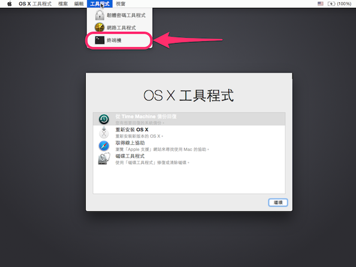

    # 開啟 MacOS 自動讀寫 NTFS

FUSE for OS X + NTFS-3G 的一次性解決方案

https://github.com/isaac-joe/NTFS


[繁體中文](https://github.com/isaac-joe/NTFS/blob/master/README-zhcn.md) | [简体中文](https://github.com/isaac-joe/NTFS/blob/master/README-zhcn.md)


> # 開始之前

需要熟悉

1. 如何 進入 MacOS 回復模式 Recovery Mode   
https://support.apple.com/zh-tw/HT201314
2. 在終端機執行指令
3. 已安裝 Homebrew  
https://brew.sh/index_zh-tw.html

> # 開始吧！

開啟終端機，執行指令：


```
# 安裝 osxfuse
$ brew cask install osxfuse

# 安裝 ntfs-3g
$ brew install ntfs-3g
```


#### 進入 Mac 回復模式

在按下電源按鈕將 Mac 開機，或在 Mac 開始重新啟動之後，立即按住鍵盤上的 Command-R 或[其他「macOS 回復」按鍵組合](https://support.apple.com/zh-tw/HT204904)之一。持續按住這些按鍵，直到出現 Apple 標誌或旋轉的地球。看到工具程式視窗，即表示完成啟動：


進入【OS X 工具程式】後，請由上方的選單列點選【工具程式】➤【終端機】




在終端機內，執行指令：

```
// 解除 「系統完整保護」功能
$ csrutil disable
```

重新開機 ➤ 進入正常模式 ➤ 開啟終端機，執行指令：

```
// 執行後，詢問並輸入登入用戶的密碼
$ sudo mv /sbin/mount_ntfs /sbin/mount_ntfs.original

// 指令執行後，詢問並輸入登入用戶的密碼
$ sudo ln -s /usr/local/sbin/mount_ntfs /sbin/mount_ntfs
```

重新開機 ➤ 再次進入 Mac 回復 ➤ 開啟終端機，執行指令：

```
// 開啟「系統完整保護」功能
$ csrutil enable
```

結束並重新開機，MacOS 已開啓 NTFS 讀寫功能。
完成！

